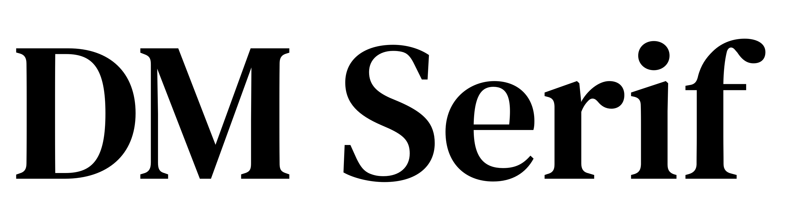
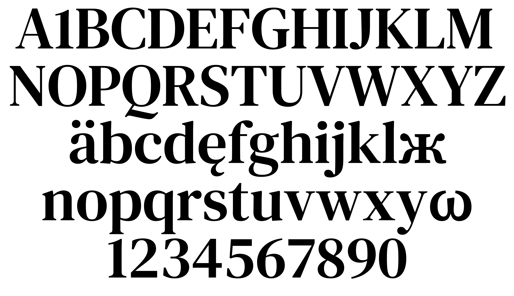
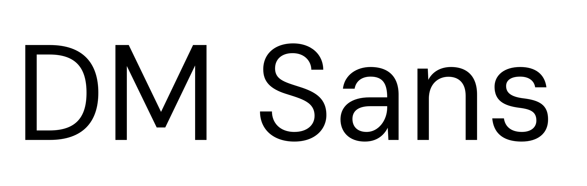
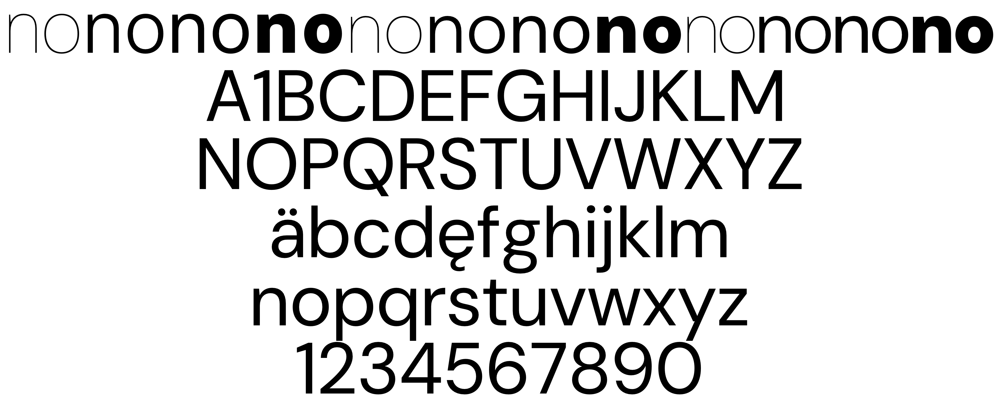

# DM Fonts

This repository contains for DM suite of fonts: Sans, Serif Text and Serif Display.
# DM Serif

The [Serif](Serif) families are derived from [Source Serif Pro](https://github.com/adobe-fonts/source-serif-pro).

# DM Sans
The [Sans](Sans) family is derived from [Poppins](https://github.com/itfoundry/Poppins).

The type design and font development was commissioned from [Colophon Foundry](https://www.colophon-foundry.org), with Creative Direction from [MultiAdaptor](https://multiadaptor.com) and the DeepMind team.

These fonts are not officially supported Google products.

## License

All fonts are licensed under the [SIL Open Font License](https://scripts.sil.org/ofl).
